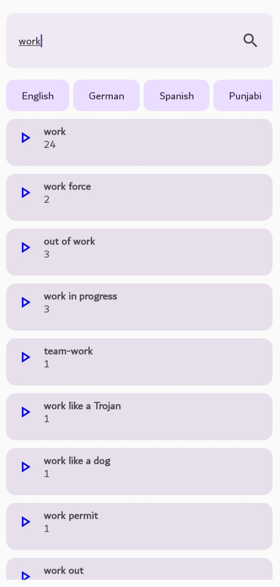
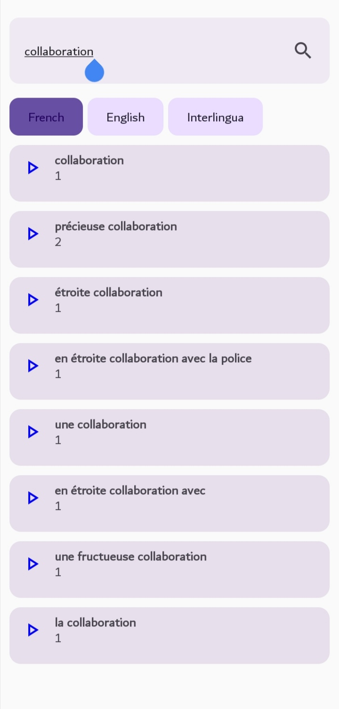
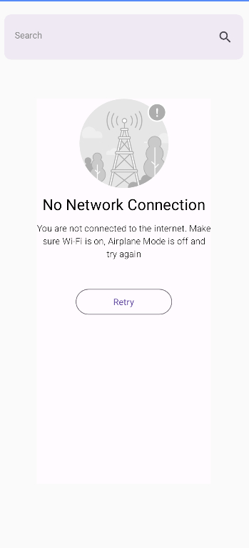
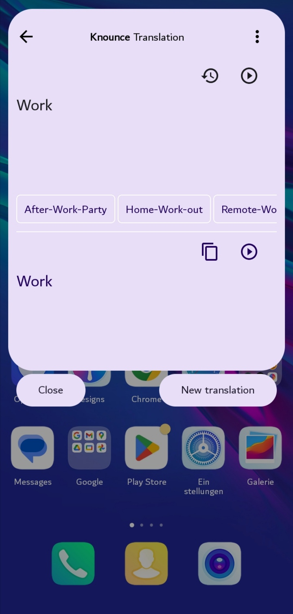
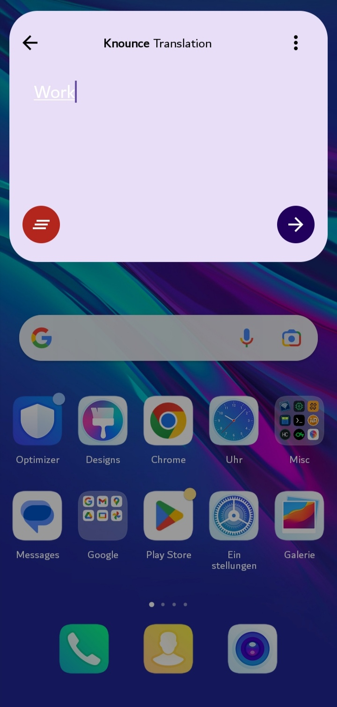

# Knounce

# Welcome to Knounce
Knounce is a language learning app that helps users learn new languages by providing pronunciation and translation features.
The app is designed to be user-friendly and intuitive, making it easy for anyone to learn a new language.

# Features
- Pronunciation
    - Users can listen to native speakers pronounce words and phrases, helping them to learn the correct pronunciation.
    - This feature is especially useful for languages with difficult pronunciation, such as Mandarin or Arabic.
- Translation
	- Knounce also offers a translation feature, allowing users to translate words and phrases from one language to another.
	- This feature is particularly useful for those who are traveling or communicating with people who speak a different language.
- Integration
	- Knounce is integrated with other apps, making it easy for users to access the app from other platforms.
	- For example, users can use Knounce within messaging apps to quickly translate messages or check pronunciation.

## Showcase

     &nbsp; 
     &nbsp; 
     &nbsp; 
     &nbsp; 
     &nbsp; 

## Install
Git clone the project and build it locally on your machine, then install it on a physical device or an emulator.

## Contributing
Pull requests are welcome. For major changes, please open an issue first
to discuss what you would like to change.

## Comparison with translation apps

| 				             | Knounce						                                                                     | Trnslation apps	                                                        |
|------------------|-----------------------------------------------------------------------------------|-------------------------------------------------------------------------|
| Translation			   | `On-demand translation for daily immersion within other activities`               | Translation offered in a confined environment of the main app interface |
| Pronunciation			 | `Authentic Human-made pronunciations with varying accents & dialects `            | Text-to-speech robotic sound	                                           |
| Integration		    | `Completely integrated with other apps through a floating bubblr or context menu` | Often tied tot he main app interface                                    |
| Privacy		        | `Your data is never shared away`                                                  | Data collection is often conducted                                      |

## License
[MIT](./LICENSE)